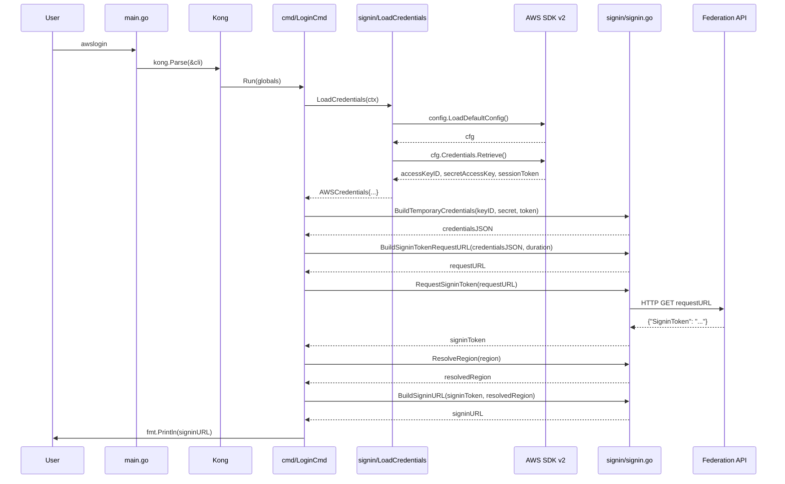
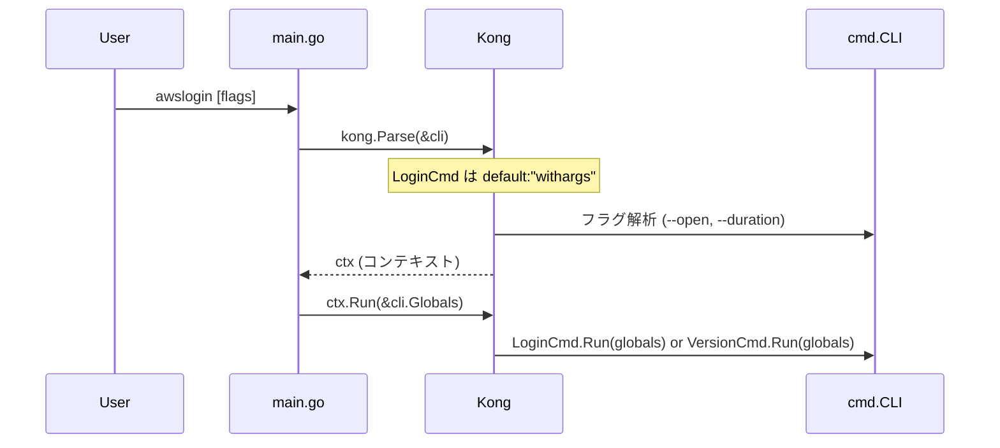
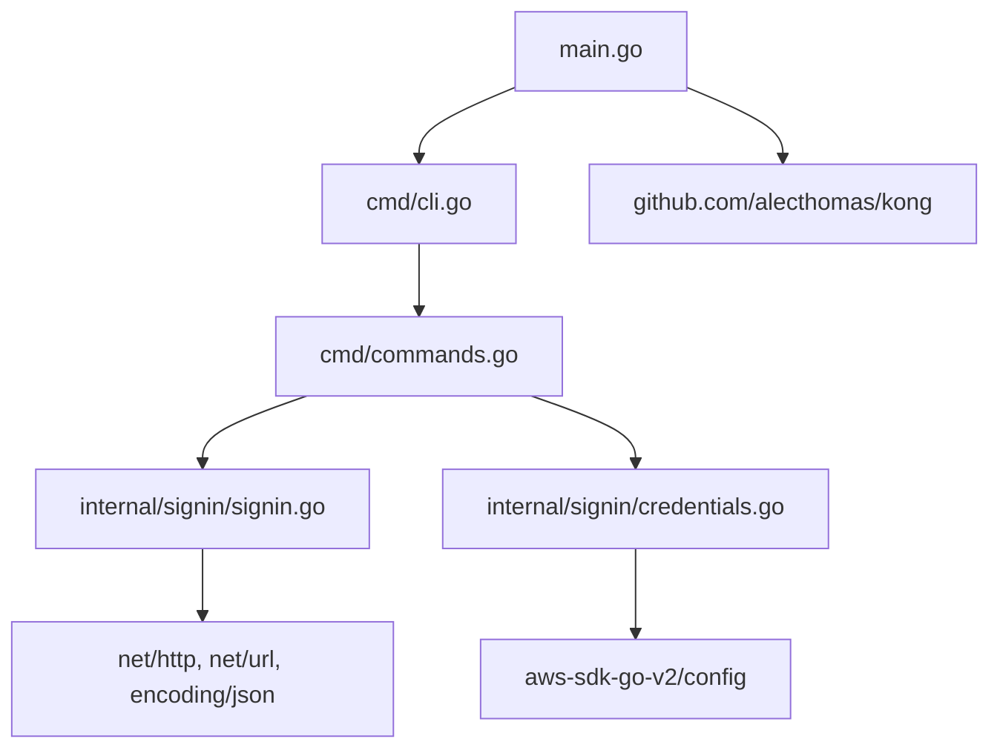

# M1: プロジェクト基盤 + コアロジック刷新

## Meta
| 項目 | 値 |
|------|---|
| ロードマップ | `plans/awslogin-roadmap.md` |
| スペック | `docs/specs/awslogin-spec.md` |
| ステータス | In Progress |
| ゴール | `awslogin` でログインURLが stdout に出力される |
| テンプレート参照 | `~/src/github.com/youyo/ccmix/`（Kong + goreleaser） |

## 対象ファイル

| ファイル | 操作 | 説明 |
|---------|------|------|
| `go.mod` | 書き換え | Go 1.24, AWS SDK v2, Kong |
| `go.sum` | 自動生成 | `go mod tidy` で生成 |
| `main.go` | 新規 | ルートに配置、Kong ブートストラップ |
| `cmd/cli.go` | 新規 | CLI/Globals 構造体定義 |
| `cmd/commands.go` | 新規 | LoginCmd, VersionCmd |
| `internal/signin/signin.go` | 新規 | コアURL生成ロジック |
| `internal/signin/signin_test.go` | 新規 | ユニットテスト |
| `internal/signin/credentials.go` | 新規 | AWS SDK v2 認証情報取得 |
| `awslogin.go` | 削除 | v2 コアロジック |
| `cli.go` | 削除 | v2 CLI |
| `awslogin/` | 削除 | v2 エントリーポイント |

## シーケンス図

### ログインURL生成フロー



### Kong CLI パース フロー



## 設計詳細

### ディレクトリ構造（M1完了時）

```
awslogin/
├── main.go                          # エントリーポイント
├── go.mod
├── go.sum
├── cmd/
│   ├── cli.go                       # CLI構造体 + Globals
│   └── commands.go                  # LoginCmd, VersionCmd
├── internal/
│   └── signin/
│       ├── signin.go                # コアURL生成ロジック
│       ├── signin_test.go           # ユニットテスト
│       └── credentials.go           # AWS SDK v2 認証情報取得
└── browse/                          # M2で刷新（M1では未変更）
    ├── browse.go
    ├── command.go
    └── command_darwin.go
```

### Kong CLI 構造体 (`cmd/cli.go`)

ccmix の `cmd/cli.go` をテンプレートとして参照:

```go
package cmd

// Globals はすべてのサブコマンドで共有されるフラグとメタ情報を保持する
type Globals struct {
    Open     bool `help:"Open URL in default browser." short:"o"`
    Duration int  `help:"Session duration in seconds." default:"3600" short:"d"`

    // goreleaser ldflags で main.go から注入されるバージョン情報
    Version string `kong:"-"`
    Commit  string `kong:"-"`
    Date    string `kong:"-"`
}

// CLI は Kong のルート構造体
type CLI struct {
    Globals

    Login   LoginCmd   `cmd:"" default:"withargs" help:"Generate AWS console login URL."`
    Version VersionCmd `cmd:"" help:"Show version information."`
}
```

**設計ポイント**:
- `LoginCmd` を `default:"withargs"` でデフォルトコマンドに設定
- `--open` と `--duration` はグローバルフラグ（`Globals` に埋め込み）
- バージョン情報は `kong:"-"` で Kong のフラグ解析から除外
- ccmix と同様に `Globals` を `CLI` に埋め込む構造
- `CompletionCmd` は M2 で追加

### コマンド実装 (`cmd/commands.go`)

```go
package cmd

import "fmt"

// LoginCmd はデフォルトコマンド。ログインURLを生成する。
type LoginCmd struct{}

func (c *LoginCmd) Run(globals *Globals) error {
    // 1. AWS認証情報取得 (signin.LoadCredentials)
    // 2. 一時認証情報JSON化 (signin.BuildTemporaryCredentials)
    // 3. SigninToken取得URL構築 (signin.BuildSigninTokenRequestURL)
    // 4. SigninToken取得 (signin.RequestSigninToken)
    // 5. リージョン解決 (signin.ResolveRegion)
    // 6. ログインURL生成 (signin.BuildSigninURL)
    // 7. stdout出力（--open時はブラウザオープン→M2で実装）
    return nil
}

// VersionCmd はバージョン情報を表示する。
type VersionCmd struct{}

func (c *VersionCmd) Run(globals *Globals) error {
    fmt.Printf("awslogin version %s (commit %s, built %s)\n",
        globals.Version, globals.Commit, globals.Date)
    return nil
}
```

### コアロジック (`internal/signin/signin.go`)

v2 の `awslogin.go` から移植・改善:

```go
package signin

import (
    "encoding/json"
    "fmt"
    "io"
    "net/http"
    "net/url"
)

const SigninBaseURL = "https://signin.aws.amazon.com/federation"
const DefaultRegion = "us-east-1"

type TemporaryCredentials struct {
    SessionID    string `json:"sessionId"`
    SessionKey   string `json:"sessionKey"`
    SessionToken string `json:"sessionToken"`
}

type signinTokenResponse struct {
    Token string `json:"SigninToken"`
}

// BuildTemporaryCredentials は認証情報をJSON文字列に変換する（純粋関数）
func BuildTemporaryCredentials(accessKeyID, secretAccessKey, sessionToken string) (string, error)

// BuildSigninTokenRequestURL はSigninToken取得用URLを構築する
func BuildSigninTokenRequestURL(credentials string, durationSeconds int) string

// RequestSigninToken はFederation APIからSigninTokenを取得する
// HTTPステータスコード 200 以外の場合はエラーを返す
func RequestSigninToken(requestURL string) (string, error)

// BuildSigninURL はログインURLを構築する
// 内部で ResolveRegion を呼び、空文字リージョンも自動的に us-east-1 にフォールバック
func BuildSigninURL(signinToken, region string) string

// ResolveRegion はリージョンを解決する（空文字の場合 us-east-1 フォールバック）
func ResolveRegion(region string) string
```

### 認証情報取得 (`internal/signin/credentials.go`)

```go
package signin

import (
    "context"
    "github.com/aws/aws-sdk-go-v2/config"
)

type AWSCredentials struct {
    AccessKeyID     string
    SecretAccessKey  string
    SessionToken    string
    Region          string
}

// LoadCredentials はAWS SDK v2でAWS認証情報とリージョンを取得する
func LoadCredentials(ctx context.Context) (*AWSCredentials, error)
```

### エントリーポイント (`main.go`)

ccmix の `main.go` をテンプレートとして参照:

```go
package main

import (
    "github.com/alecthomas/kong"
    "github.com/youyo/awslogin/cmd"
)

// goreleaser ldflags で埋め込まれる
var (
    version = "dev"
    commit  = "none"
    date    = "unknown"
)

func main() {
    var cli cmd.CLI
    cli.Version = version
    cli.Commit = commit
    cli.Date = date

    ctx := kong.Parse(&cli,
        kong.Name("awslogin"),
        kong.Description("Generate AWS Management Console login URL."),
        kong.UsageOnError(),
    )
    ctx.FatalIfErrorf(ctx.Run(&cli.Globals))
}
```

## TDD テスト設計

### テストケース一覧 (`internal/signin/signin_test.go`)

| # | テストケース | 関数 | 入力 | 期待出力 |
|---|-------------|------|------|---------|
| 1 | 正常系: 認証情報JSON化 | `BuildTemporaryCredentials` | keyID, secret, token | `{"sessionId":"keyID","sessionKey":"secret","sessionToken":"token"}` |
| 2 | 正常系: SigninToken取得URL | `BuildSigninTokenRequestURL` | credentials JSON, 3600 | URL に `Action=getSigninToken`, `SessionDuration=3600` 含む |
| 3 | 正常系: ログインURL (ap-northeast-1) | `BuildSigninURL` | signinToken, "ap-northeast-1" | URL に `Action=login`, `Destination` に `ap-northeast-1.console.aws.amazon.com` 含む |
| 4 | 正常系: ログインURL (us-east-1) | `BuildSigninURL` | signinToken, "us-east-1" | URL に `Destination` に `console.aws.amazon.com` 含む（リージョンプレフィックスなし） |
| 5 | フォールバック: リージョン空文字 | `BuildSigninURL` | signinToken, "" | us-east-1 と同じ結果（`console.aws.amazon.com`） |
| 6 | 正常系: SigninToken取得 | `RequestSigninToken` | httptest モック | SigninToken 文字列 |
| 7 | エラー: 不正JSON応答 | `RequestSigninToken` | 不正JSON返すモック | error |
| 7b | エラー: HTTPステータス非200 | `RequestSigninToken` | 403返すモック | error（ステータスコード含む） |
| 8 | フォールバック: ResolveRegion 空文字 | `ResolveRegion` | "" | "us-east-1" |
| 9 | そのまま: ResolveRegion 指定あり | `ResolveRegion` | "ap-northeast-1" | "ap-northeast-1" |

### TDD サイクル詳細

各テストケースに対して **Red -> Green -> Refactor** を厳密に繰り返す:

#### Round 1: 純粋関数群（テスト #1, #8, #9）
1. **Red**: `signin_test.go` に `TestBuildTemporaryCredentials`, `TestResolveRegion` を書く
   - `signin.go` にシグネチャだけ定義 → コンパイルは通るがテスト FAIL
2. **Green**: 最小限の実装でテスト PASS
3. **Refactor**: 不要な変数除去、命名改善

#### Round 2: URL構築関数（テスト #2, #3, #4, #5）
1. **Red**: `TestBuildSigninTokenRequestURL`, `TestBuildSigninURL` を書く
2. **Green**: `url.Values` を使ったURL構築実装
3. **Refactor**: リージョンとコンソールURLのマッピングロジック整理

#### Round 3: HTTP通信関数（テスト #6, #7）
1. **Red**: `TestRequestSigninToken_Success`, `TestRequestSigninToken_InvalidJSON` を書く
   - `net/http/httptest` でモックサーバー構築
2. **Green**: `http.Get` + `io.ReadAll` + `json.Unmarshal` 実装
3. **Refactor**: エラーハンドリング統一

### テストコード例

```go
package signin

import (
    "encoding/json"
    "net/http"
    "net/http/httptest"
    "net/url"
    "testing"
)

func TestBuildTemporaryCredentials(t *testing.T) {
    got, err := BuildTemporaryCredentials("AKID", "SECRET", "TOKEN")
    if err != nil {
        t.Fatalf("unexpected error: %v", err)
    }
    var creds TemporaryCredentials
    if err := json.Unmarshal([]byte(got), &creds); err != nil {
        t.Fatalf("invalid JSON: %v", err)
    }
    if creds.SessionID != "AKID" || creds.SessionKey != "SECRET" || creds.SessionToken != "TOKEN" {
        t.Errorf("got %s, want sessionId=AKID, sessionKey=SECRET, sessionToken=TOKEN", got)
    }
}

func TestResolveRegion(t *testing.T) {
    tests := []struct {
        input string
        want  string
    }{
        {"", "us-east-1"},
        {"ap-northeast-1", "ap-northeast-1"},
        {"eu-west-1", "eu-west-1"},
    }
    for _, tt := range tests {
        if got := ResolveRegion(tt.input); got != tt.want {
            t.Errorf("ResolveRegion(%q) = %q, want %q", tt.input, got, tt.want)
        }
    }
}

func TestBuildSigninTokenRequestURL(t *testing.T) {
    u := BuildSigninTokenRequestURL(`{"sessionId":"x"}`, 3600)
    parsed, _ := url.Parse(u)
    q := parsed.Query()
    if q.Get("Action") != "getSigninToken" {
        t.Errorf("Action = %q, want getSigninToken", q.Get("Action"))
    }
    if q.Get("SessionDuration") != "3600" {
        t.Errorf("SessionDuration = %q, want 3600", q.Get("SessionDuration"))
    }
}

func TestBuildSigninURL_APNortheast1(t *testing.T) {
    u := BuildSigninURL("mytoken", "ap-northeast-1")
    parsed, _ := url.Parse(u)
    q := parsed.Query()
    if q.Get("Action") != "login" {
        t.Errorf("Action = %q, want login", q.Get("Action"))
    }
    dest := q.Get("Destination")
    if dest != "https://ap-northeast-1.console.aws.amazon.com/" {
        t.Errorf("Destination = %q, want ap-northeast-1 URL", dest)
    }
}

func TestBuildSigninURL_USEast1(t *testing.T) {
    u := BuildSigninURL("mytoken", "us-east-1")
    parsed, _ := url.Parse(u)
    dest := parsed.Query().Get("Destination")
    if dest != "https://console.aws.amazon.com/" {
        t.Errorf("Destination = %q, want console.aws.amazon.com (no region prefix)", dest)
    }
}

func TestBuildSigninURL_EmptyRegionFallback(t *testing.T) {
    u := BuildSigninURL("mytoken", "")
    parsed, _ := url.Parse(u)
    dest := parsed.Query().Get("Destination")
    if dest != "https://console.aws.amazon.com/" {
        t.Errorf("empty region should fallback to us-east-1, got Destination = %q", dest)
    }
}

func TestRequestSigninToken_Success(t *testing.T) {
    ts := httptest.NewServer(http.HandlerFunc(func(w http.ResponseWriter, r *http.Request) {
        w.Write([]byte(`{"SigninToken":"test-token-123"}`))
    }))
    defer ts.Close()

    token, err := RequestSigninToken(ts.URL)
    if err != nil {
        t.Fatalf("unexpected error: %v", err)
    }
    if token != "test-token-123" {
        t.Errorf("got %q, want test-token-123", token)
    }
}

func TestRequestSigninToken_InvalidJSON(t *testing.T) {
    ts := httptest.NewServer(http.HandlerFunc(func(w http.ResponseWriter, r *http.Request) {
        w.Write([]byte(`not json`))
    }))
    defer ts.Close()

    _, err := RequestSigninToken(ts.URL)
    if err == nil {
        t.Error("expected error for invalid JSON, got nil")
    }
}

func TestRequestSigninToken_HTTPError(t *testing.T) {
    ts := httptest.NewServer(http.HandlerFunc(func(w http.ResponseWriter, r *http.Request) {
        w.WriteHeader(http.StatusForbidden)
        w.Write([]byte(`{"Error":"AccessDenied"}`))
    }))
    defer ts.Close()

    _, err := RequestSigninToken(ts.URL)
    if err == nil {
        t.Error("expected error for HTTP 403, got nil")
    }
}
```

## 実装ステップ（詳細）

### Step 1: go.mod 初期化 + v2 コード削除
- [ ] v2 ファイル削除: `awslogin.go`, `cli.go`, `awslogin/`（ディレクトリごと）
- [ ] `go.mod` 書き換え:
  ```
  module github.com/youyo/awslogin
  go 1.24
  ```
- [ ] 旧 `go.sum` 削除（`go mod tidy` で再生成）
- [ ] `_awslogin`（旧 zsh 補完ファイル）は M3 で削除（M1 では触らない）
- [ ] browse/ は M2 で刷新するため M1 では一旦残す（ただし go.mod からは旧依存を削除するため browse/ のビルドは壊れる。M1 時点では browse/ をビルド対象外にする）

### Step 2: internal/signin テストファースト実装（TDD）
- [ ] `internal/signin/` ディレクトリ作成
- [ ] `internal/signin/signin_test.go` — テストケース #1〜#9 を先に書く（**Red**）
- [ ] `internal/signin/signin.go` — テストを通す実装（**Green**）
  - `BuildTemporaryCredentials`: json.Marshal
  - `BuildSigninTokenRequestURL`: url.Values で構築
  - `RequestSigninToken`: http.Get + io.ReadAll + json.Unmarshal
  - `BuildSigninURL`: リージョンに応じた Destination URL 構築
  - `ResolveRegion`: 空文字チェック
- [ ] リファクタリング（**Refactor**）
  - 定数整理、エラーメッセージ統一
- [ ] `go test -race ./internal/signin/...` 全テスト PASS 確認

### Step 3: AWS SDK v2 認証情報取得
- [ ] `internal/signin/credentials.go` — `LoadCredentials` 実装
  - `config.LoadDefaultConfig(ctx)` で設定ロード
  - `cfg.Credentials.Retrieve(ctx)` で認証情報取得
  - `cfg.Region` でリージョン取得、空なら `ResolveRegion` でフォールバック
- [ ] 依存追加: `go get github.com/aws/aws-sdk-go-v2/config github.com/aws/aws-sdk-go-v2/credentials`
- [ ] Note: `LoadCredentials` は外部依存（AWS SDK）のため、ユニットテスト対象外。統合テストで検証。

### Step 4: Kong CLI 構造体定義 + コマンド実装
- [ ] `cmd/` ディレクトリ作成
- [ ] `cmd/cli.go` — CLI, Globals 構造体（ccmix テンプレート参照）
- [ ] `cmd/commands.go` — LoginCmd.Run, VersionCmd.Run 実装
  - LoginCmd.Run: LoadCredentials → BuildTemporaryCredentials → BuildSigninTokenRequestURL → RequestSigninToken → ResolveRegion → BuildSigninURL → fmt.Println
  - VersionCmd.Run: fmt.Printf でバージョン情報出力
- [ ] 依存追加: `go get github.com/alecthomas/kong`

### Step 5: main.go エントリーポイント
- [ ] `main.go` — Kong ブートストラップ（ccmix テンプレート参照）
  - ldflags 用変数（version, commit, date）
  - `kong.Parse` + `ctx.Run`
- [ ] `go build` でバイナリ生成確認

### Step 6: 検証
- [ ] `go test -race ./...` 全テスト PASS
- [ ] `go vet ./...` PASS
- [ ] `go build -o /dev/null` 成功
- [ ] 実際のAWS認証情報で `./awslogin` 実行 → URL 出力確認（手動）

## v2 -> v3 関数マッピング

| v2 (`awslogin.go`) | v3 (`internal/signin/`) | 変更点 |
|---------------------|------------------------|--------|
| `NewAwsSession()` | `LoadCredentials()` | SDK v1 Session -> SDK v2 config.LoadDefaultConfig |
| `BuildTemporaryCredentials(sess)` | `BuildTemporaryCredentials(keyID, secret, token)` | セッション依存を排除、純粋関数化 |
| `BuildSigninTokenRequestURL(creds, duration)` | `BuildSigninTokenRequestURL(creds, duration)` | duration を string -> int に変更 |
| `RequestSigninToken(url)` | `RequestSigninToken(url)` | ioutil.ReadAll -> io.ReadAll |
| `BuildSigninURL(token, region)` | `BuildSigninURL(token, region)` | リージョンフォールバック追加、us-east-1 の URL 修正 |
| `Run()` (`cli.go`) | `LoginCmd.Run()` (`cmd/commands.go`) | Cobra -> Kong, Viper 不要 |
| `PreRun()` (`cli.go`) | 削除 | プロファイル選択UI廃止 |

## リージョンとコンソールURLの対応

| リージョン | コンソールURL |
|-----------|-------------|
| `us-east-1` | `https://console.aws.amazon.com/` |
| その他（例: `ap-northeast-1`） | `https://ap-northeast-1.console.aws.amazon.com/` |
| 空文字（未設定） | `https://console.aws.amazon.com/`（us-east-1 フォールバック） |

## リスク評価

| # | リスク | 影響度 | 発生確率 | 対策 |
|---|--------|-------|---------|------|
| R1 | browse/ パッケージのビルド破壊 | 中 | 高 | M1 では browse/ を go build 対象外にする。browse/ は独立パッケージなので main.go から import しなければ影響なし |
| R2 | AWS SDK v2 の認証情報取得が v1 と挙動が異なる | 高 | 低 | SDK v2 の config loader は v1 と同等の機能を持つ。AWS_PROFILE, ~/.aws/credentials 等すべて対応。MFA も SDK v2 が自動処理 |
| R3 | Kong の `default:"withargs"` が期待通り動作しない | 中 | 低 | ccmix で実績あり。Kong v1.14+ で安定。テストで確認 |
| R4 | Federation API のレスポンス形式変更 | 高 | 極低 | AWS 側の変更。httptest でモックテストしているため、API 形式変更時はテスト修正で対応 |
| R5 | go.mod のモジュールパス変更によるインポートパス不整合 | 高 | 低 | モジュールパスは `github.com/youyo/awslogin` のまま維持。変更なし |
| R6 | v2 コード削除時に必要なロジックを見落とす | 中 | 低 | v2->v3 関数マッピング表で全関数の移行先を明記済み |

## 依存関係図



## 完了条件チェックリスト

- [ ] `internal/signin/signin_test.go` — 9テストケース全 PASS
- [ ] `go test -race ./...` 全テスト PASS
- [ ] `go vet ./...` PASS
- [ ] `go build` でバイナリ生成成功
- [ ] v2 ファイル（`awslogin.go`, `cli.go`, `awslogin/`）削除済み
- [ ] `main.go` + `cmd/` + `internal/signin/` の新規構造確立
- [ ] コミット完了
