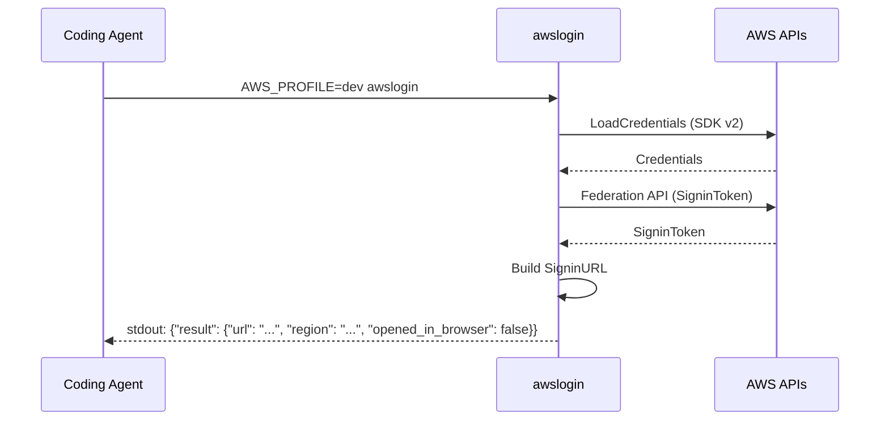
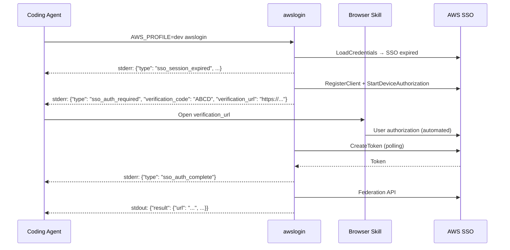
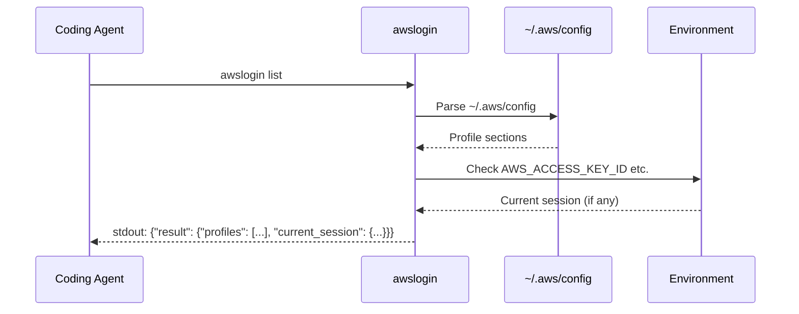

# awslogin JSON 出力化 + list コマンド + スキル作成

## Context

awslogin は現在、人間向けのプレーンテキスト出力（stdout に URL、stderr に認証進捗）。
coding-agent（Claude Code 等）から利用する際、出力のパースが困難で、エラーハンドリングも文字列マッチに依存する。

**目的**: 全出力を JSON 化し、`list` コマンドと `--profile` フラグを追加して、coding-agent が awslogin をプログラマティックに利用できるようにする。さらに Claude Code スキルを作成して、エージェントの利用パターンを定義する。

## スコープ

### 実装範囲
- 全コマンドの stdout/stderr を常時 JSON 出力（completion 除外）
- 構造化エラーコード付きエラー出力
- OIDC デバイス認証フローの stderr JSON イベント化
- `awslogin list` コマンド新規追加（プロファイル一覧 + カレントセッション認証情報）
- `skills/awslogin/SKILL.md` 作成

### スコープ外
- completion コマンドの JSON 化（シェルスクリプト出力のため）
- `--help` の JSON 化（人間向けのまま）
- セッション状態チェック機能（将来検討）

---

## 1. JSON 出力レイヤー設計

### 新規パッケージ: `internal/jsonout/`

```go
// jsonout.go
type Writer struct {
    stdout io.Writer
    stderr io.Writer
}

func New(stdout, stderr io.Writer) *Writer

// stdout に正常系結果を出力
func (w *Writer) WriteResult(v interface{}) error
// stdout に構造化エラーを出力
func (w *Writer) WriteError(err error) error
// stderr にイベントを出力
func (w *Writer) WriteEvent(event interface{}) error
```

### JSON スキーマ

**正常系（stdout）**:
```json
{"result": {"url": "https://...", "region": "ap-northeast-1", "opened_in_browser": false}}
```

**エラー（stdout、exit code 1）**:
```json
{"error": {"code": "SSO_SESSION_EXPIRED", "message": "SSO session expired", "details": "Run 'awslogin' to re-authenticate"}}
```

**進捗イベント（stderr、NDJSON）**:
```json
{"type": "sso_auth_required", "verification_code": "ABCD-EFGH", "verification_url": "https://device.sso.../?user_code=ABCD-EFGH"}
```

---

## 2. エラーコード体系

```go
// internal/jsonout/errors.go
type AppError struct {
    Code    string
    Message string
    Details string
    Cause   error
}
```

| コード | 意味 | 発生箇所 |
|--------|------|----------|
| `INVALID_ARGS` | CLI 引数パースエラー | `main.go` |
| `CONFIG_LOAD_FAILED` | AWS config 読み込み失敗 | `credentials.go`, `config.go` |
| `SSO_SESSION_EXPIRED` | SSO セッション期限切れ | `credentials.go` |
| `SSO_LOGIN_FAILED` | OIDC 認証フロー失敗 | `login.go` |
| `SSO_LEGACY_CONFIG` | レガシー SSO 設定検出 | `config.go` |
| `OIDC_REGISTER_FAILED` | OIDC クライアント登録失敗 | `oidc.go` |
| `OIDC_DEVICE_AUTH_FAILED` | デバイス認証開始失敗 | `oidc.go` |
| `OIDC_TOKEN_EXPIRED` | デバイス認証トークン期限切れ | `oidc.go` |
| `FEDERATION_API_FAILED` | Federation API エラー | `signin.go` |
| `BROWSER_OPEN_FAILED` | ブラウザ起動失敗（非致命的） | `browse.go` |
| `INTERNAL_ERROR` | 予期しないエラー | 全般（フォールバック） |

---

## 3. 各コマンドの JSON 出力

### login（デフォルト）
```json
// stdout
{"result": {"url": "https://signin.aws.amazon.com/federation?...", "region": "ap-northeast-1", "opened_in_browser": false}}
```

### version
```json
// stdout
{"result": {"version": "v3.2.1"}}
```

### list（新規）
```json
// stdout
{"result": {"profiles": [
  {"name": "dev", "type": "sso", "sso_start_url": "https://d-xxx.awsapps.com/start", "region": "ap-northeast-1"},
  {"name": "prod", "type": "sso", "sso_start_url": "https://d-xxx.awsapps.com/start", "region": "us-east-1"},
  {"name": "legacy", "type": "credentials", "region": "ap-northeast-1"}
], "current_session": {"aws_access_key_id": "ASIA...(masked)", "has_session_token": true, "region": "ap-northeast-1", "source": "environment"}}}
```

**current_session の仕様:**
- 環境変数 `AWS_ACCESS_KEY_ID` が設定されている場合に出力
- `aws_access_key_id` は先頭4文字 + `...` でマスク（セキュリティ）
- `has_session_token`: `AWS_SESSION_TOKEN` の有無（bool）
- `region`: `AWS_REGION` or `AWS_DEFAULT_REGION`
- `source`: `"environment"`（将来的に他ソース追加可能）
- 環境変数未設定時は `"current_session": null`

### completion（変更なし）
シェルスクリプトをそのまま出力。JSON 化対象外。

---

## 4. OIDC フロー stderr JSON イベント

| type | フィールド | タイミング |
|------|-----------|-----------|
| `sso_session_expired` | `message` | SSO セッション期限切れ検出時 |
| `sso_auth_required` | `verification_code`, `verification_url`, `verification_url_base` | デバイス認証 URL 生成時 |
| `browser_opened` | `url` | ブラウザ自動起動成功時 |
| `browser_open_failed` | `message` | ブラウザ起動失敗時（非致命的） |
| `sso_auth_complete` | - | 認証完了時 |

**設計判断**: `sso_auth_pending`（ポーリング中）は出力しない。ノイズ軽減。agent は `sso_auth_required` 受信後にブラウザ操作を開始し、stdout の結果を待つ。

---

## 5. CLI 構造変更

### プロファイル指定
`--profile` フラグは追加しない。`AWS_PROFILE` 環境変数での指定一択。
agent は `AWS_PROFILE=dev awslogin` で実行する。

### `--open` フラグ
現行の `--open` は人間向け機能としてそのまま維持。JSON 出力の `opened_in_browser` フィールドでブラウザ起動の有無を通知する。

### list コマンド追加（`cmd/cli.go`）
```go
type CLI struct {
    Globals
    Login      LoginCmd      `cmd:"" default:"withargs" help:"Generate AWS console login URL."`
    List       ListCmd       `cmd:"" help:"List available AWS profiles and current session."`  // 新規
    Version    VersionCmd    `cmd:"" help:"Show version information."`
    Completion CompletionCmd `cmd:"" help:"Generate shell completion script."`
}

type ListCmd struct{}
```

### Kong パース分離（`main.go`）
```go
// FatalIfErrorf を使わず、エラーを JSON で出力
parser, err := kong.New(&cli, kong.Name("awslogin"), ...)
if err != nil { ... }
kctx, err := parser.Parse(os.Args[1:])
if err != nil {
    out.WriteError(&jsonout.AppError{Code: "INVALID_ARGS", Message: err.Error()})
    os.Exit(1)
}
if err := kctx.Run(&cli.Globals, out); err != nil {
    out.WriteError(err)
    os.Exit(1)
}
```

---

## 6. 依存性注入の変更

現在 `os.Stderr` に直接書き込んでいる箇所を `io.Writer` 注入に変更:

| 関数 | 変更内容 |
|------|---------|
| `sso.Login(ctx)` | → `sso.Login(ctx, events io.Writer)` |
| `sso.RunDeviceAuthFlow(ctx, client, cfg, openBrowser)` | → `RunDeviceAuthFlow(ctx, client, cfg, openBrowser, events io.Writer)` |
| `signin.LoadCredentials(ctx)` | → `signin.LoadCredentials(ctx, events io.Writer)` |
| `LoginCmd.Run(globals)` | → `LoginCmd.Run(globals, out *jsonout.Writer)` |
| `VersionCmd.Run(globals)` | → `VersionCmd.Run(globals, out *jsonout.Writer)` |

Kong の `Run` は `kong.Bind` で `*jsonout.Writer` を注入:
```go
kctx.Bind(out)
```

---

## 7. list コマンド実装

### 新規ファイル: `internal/profile/profile.go`

```go
package profile

type Profile struct {
    Name        string `json:"name"`
    Type        string `json:"type"`          // "sso" | "credentials" | "assume_role"
    SSOStartURL string `json:"sso_start_url,omitempty"`
    Region      string `json:"region,omitempty"`
}

type CurrentSession struct {
    AWSAccessKeyID  string `json:"aws_access_key_id"`   // マスク済み
    HasSessionToken bool   `json:"has_session_token"`
    Region          string `json:"region,omitempty"`
    Source          string `json:"source"`               // "environment"
}

// ListProfiles は ~/.aws/config からプロファイル一覧を返す
func ListProfiles(ctx context.Context) ([]Profile, error)

// DetectCurrentSession は環境変数からカレントセッション情報を返す
func DetectCurrentSession() *CurrentSession  // nil if no env vars set
```

**実装方針:**
- `~/.aws/config` のパースは `gopkg.in/ini.v1` または Go 標準の INI パーサーを使用
- AWS SDK v2 の `config.LoadSharedConfigProfile` は全プロファイルの列挙に対応していないため、INI ファイルを直接パースする
- `[profile xxx]` セクションを列挙し、`sso_start_url` の有無で type を判定
- `AWS_ACCESS_KEY_ID` 環境変数のマスク: 先頭4文字 + `"..."` (例: `"ASIA..."`)

---

## テスト設計書

### Phase 1: internal/jsonout（Red → Green → Refactor）

| ID | テスト | 入力 | 期待出力 |
|----|--------|------|----------|
| J1 | `TestWriteResult_Login` | `LoginResult{URL: "https://...", Region: "ap-northeast-1"}` | `{"result":{"url":"https://...","region":"ap-northeast-1","opened_in_browser":false}}` + 改行 |
| J2 | `TestWriteResult_Version` | `VersionResult{Version: "v3.2.1"}` | `{"result":{"version":"v3.2.1"}}` + 改行 |
| J3 | `TestWriteError_AppError` | `AppError{Code: "SSO_SESSION_EXPIRED", Message: "expired"}` | `{"error":{"code":"SSO_SESSION_EXPIRED","message":"expired"}}` |
| J4 | `TestWriteError_GenericError` | `errors.New("something")` | `{"error":{"code":"INTERNAL_ERROR","message":"something"}}` |
| J5 | `TestWriteError_WrappedAppError` | `fmt.Errorf("wrap: %w", &AppError{...})` | AppError のコードが使われる |
| J6 | `TestWriteEvent` | `SSOAuthRequired{...}` | stderr に JSON 1行出力 |
| J7 | `TestAppError_Unwrap` | `AppError{Cause: io.EOF}` | `errors.Is(err, io.EOF) == true` |

### Phase 2: internal/profile（Red → Green → Refactor）

| ID | テスト | 入力 | 期待出力 |
|----|--------|------|----------|
| P1 | `TestListProfiles_SSOProfiles` | SSO 設定を含む config ファイル | `[]Profile{{Name: "dev", Type: "sso", ...}}` |
| P2 | `TestListProfiles_MixedProfiles` | SSO + credentials 混在 | 両方の type が正しく設定される |
| P3 | `TestListProfiles_EmptyConfig` | 空の config | 空スライス、エラーなし |
| P4 | `TestListProfiles_NoConfigFile` | ファイルなし | 空スライス、エラーなし |
| P5 | `TestDetectCurrentSession_WithEnvVars` | `AWS_ACCESS_KEY_ID=ASIAXXX...` | `CurrentSession{AWSAccessKeyID: "ASIA...", HasSessionToken: true}` |
| P6 | `TestDetectCurrentSession_NoEnvVars` | 環境変数未設定 | `nil` |
| P7 | `TestDetectCurrentSession_MaskAccessKeyID` | `ASIAXXXXXXXXXXX` | `"ASIA..."` |
| P8 | `TestListProfiles_DefaultProfile` | `[default]` セクション | `Profile{Name: "default", ...}` |

### Phase 3: コマンドの JSON 出力テスト

| ID | テスト | 入力 | 期待出力 |
|----|--------|------|----------|
| C1 | `TestLoginCmd_JSONOutput` | `bytes.Buffer` を stdout に注入 | JSON パース可能な出力 |
| C2 | `TestVersionCmd_JSONOutput` | 同上 | `{"result":{"version":"..."}}` |
| C3 | `TestListCmd_JSONOutput` | テスト用 config + 環境変数 | profiles + current_session の JSON |

### Phase 4: OIDC フローの stderr イベントテスト

| ID | テスト | 条件 | 期待 stderr |
|----|--------|------|------------|
| O1 | `TestRunDeviceAuthFlow_SSOAuthRequiredEvent` | 正常フロー | `{"type":"sso_auth_required",...}` |
| O2 | `TestRunDeviceAuthFlow_BrowserOpenFailedEvent` | ブラウザ失敗 | `{"type":"browser_open_failed",...}` |
| O3 | `TestRunDeviceAuthFlow_SSOAuthCompleteEvent` | 認証成功 | `{"type":"sso_auth_complete"}` |
| O4 | `TestLoadCredentials_SSOExpiredEvent` | SSO 期限切れ | `{"type":"sso_session_expired",...}` |

---

## 実装手順

### Step 1: `internal/jsonout` パッケージ作成（TDD）
- ファイル: `internal/jsonout/jsonout.go`, `errors.go`, `jsonout_test.go`, `errors_test.go`
- 概要: Writer, AppError, エラーコード定数、WriteResult/WriteError/WriteEvent
- 依存: なし

### Step 2: `internal/profile` パッケージ作成（TDD）
- ファイル: `internal/profile/profile.go`, `profile_test.go`
- 概要: ListProfiles, DetectCurrentSession
- 依存: なし（Step 1 と並列可能）

### Step 3: `internal/sso` の io.Writer 注入
- ファイル: `internal/sso/oidc.go`, `login.go`, `oidc_test.go`, `login_test.go`
- 概要: `RunDeviceAuthFlow` と `Login` に `events io.Writer` 引数追加、stderr JSON イベント出力
- 依存: Step 1

### Step 4: `internal/signin` の io.Writer 注入
- ファイル: `internal/signin/credentials.go`
- 概要: `LoadCredentials` に `events io.Writer` 追加、`sso_session_expired` イベント出力
- 依存: Step 3

### Step 5: `cmd/` の JSON 出力化 + list コマンド追加
- ファイル: `cmd/cli.go`, `cmd/commands.go`, `cmd/list.go`（新規）
- 概要: Globals に `Profile` 追加、ListCmd 追加、Run メソッドで `jsonout.Writer` 使用
- 依存: Step 1, 2, 4

### Step 6: `main.go` の Kong パース分離
- ファイル: `main.go`
- 概要: `kong.New` + `Parse` 分離、JSON エラーハンドリング、`kong.Bind(out)`
- 依存: Step 5

### Step 7: 既存テスト更新
- ファイル: `internal/sso/oidc_test.go`, `login_test.go`, `internal/signin/signin_test.go`
- 概要: シグネチャ変更に合わせたテスト修正
- 依存: Step 3, 4

### Step 8: `skills/awslogin/SKILL.md` 作成
- ファイル: `skills/awslogin/SKILL.md`
- 概要: Claude Code スキル定義（JSON 出力仕様確定後に作成）
- 依存: Step 6（出力仕様確定後）

### Step 9: README.md 更新
- ファイル: `README.md`
- 概要: JSON 出力の使い方、list コマンドのドキュメント

---

## アーキテクチャ検討

### 既存パターンとの整合性
- `internal/` 配下にパッケージ追加（`jsonout`, `profile`）→ 既存パターンに一致
- Kong の `Bind` による DI → Kong の標準パターン
- `io.Writer` 注入 → Go の慣用パターン（`sso.OIDCClient` インターフェースと同じ方針）

### 新規モジュール設計
- `internal/jsonout`: 薄いラッパー。JSON エンコード + エラー型定義のみ
- `internal/profile`: AWS config パース。`gopkg.in/ini.v1` or 標準ライブラリ
  - **判断**: AWS SDK v2 は `~/.aws/config` の全プロファイル列挙 API を提供していないため、INI パーサーが必要
  - Go 標準ライブラリに INI パーサーはないので、`gopkg.in/ini.v1` を追加するか、簡易パーサーを自前実装するか → **自前実装を推奨**（依存追加を最小化、awslogin の config は `[profile xxx]` + `sso_start_url` 等の単純な構造）

---

## シーケンス図

### login コマンド（SSO 認証不要の場合）



### login コマンド（SSO 認証が必要な場合）



### list コマンド



---

## リスク評価

| リスク | 重大度 | 対策 |
|--------|--------|------|
| 破壊的変更（全出力 JSON 化） | 中 | セマンティックバージョニング: マイナーバンプ（v3.3.0）。既に coding-agent 向けと割り切り済み |
| Kong パースエラーの JSON 化漏れ | 高 | `kong.New` + `Parse` 分離で全エラーをキャッチ |
| `~/.aws/config` パース不備 | 中 | INI パーサーは `[profile xxx]` と `[default]` のみ対象。テストで網羅 |
| 環境変数マスクの不完全性 | 低 | `AWS_SECRET_ACCESS_KEY` は出力しない。`ACCESS_KEY_ID` は先頭4文字のみ |
| OIDC ポーリング中の stderr 出力タイミング | 低 | イベントは `sso_auth_required` 1回のみ。ポーリング中は無出力 |
| 既存テストの破壊 | 高 | シグネチャ変更は Step 7 で一括対応。`go test ./...` で検証 |

### ロールバック計画
- Git タグで v3.2.1 にロールバック可能
- 全変更は1ブランチで管理

---

## SKILL.md 構成案

```
skills/awslogin/SKILL.md
├── Front matter (name, description, triggers)
├── Overview
├── Core Philosophy (LLM-first, JSON-native)
├── Output Format (stdout/stderr JSON 仕様)
├── Commands (login, list, version)
├── SSO Authentication Flow (agent + browser skill 連携パターン)
├── Error Handling (エラーコード一覧)
├── Environment Variables
├── Recommended Agent Patterns
│   ├── awslogin list → ユーザーに選択させる → AWS_PROFILE=xxx awslogin
│   ├── SSO 認証 → ブラウザスキル連携
│   └── エラーリカバリ
└── Anti-patterns
```

---

## チェックリスト

### 観点1: 実装実現可能性（5項目）
- [x] 手順の抜け漏れがないか（Step 1-9 で端から端まで）
- [x] 各ステップが十分に具体的か（ファイル名・関数シグネチャ明示）
- [x] 依存関係が明示されているか（各 Step に依存記載）
- [x] 変更対象ファイルが網羅されているか（新規5 + 変更8 = 13ファイル）
- [x] 影響範囲が正確に特定されているか（全コマンドの出力形式変更）

### 観点2: TDDテスト設計（6項目）
- [x] 正常系テストケースが網羅（J1-J2, P1-P2, C1-C3）
- [x] 異常系テストケースが定義（J3-J5, P3-P4）
- [x] エッジケースが考慮（P6-P8, J7）
- [x] 入出力が具体的に記述（JSON 文字列で明示）
- [x] Red→Green→Refactor の順序が守られているか
- [x] モック設計が適切か（io.Writer 注入、bytes.Buffer でキャプチャ）

### 観点3: アーキテクチャ整合性（5項目）
- [x] 既存の命名規則に従っている（internal/ 配下、snake_case ファイル）
- [x] 設計パターンが一貫（io.Writer 注入、Kong Bind）
- [x] モジュール分割が適切（jsonout = 出力、profile = データ）
- [x] 依存方向が正しい（cmd → jsonout, profile → 標準ライブラリ）
- [x] 類似機能との統一性（sso.OIDCClient インターフェースパターンに準拠）

### 観点4: リスク評価と対策（6項目）
- [x] リスクが適切に特定されている
- [x] 対策が具体的
- [x] フェイルセーフが考慮（AppError → INTERNAL_ERROR フォールバック）
- [x] パフォーマンスへの影響（JSON エンコードのオーバーヘッドは無視可能）
- [x] セキュリティ観点（ACCESS_KEY_ID マスク、SECRET 非出力）
- [x] ロールバック計画あり

### 観点5: シーケンス図（5項目）
- [x] 正常フローが記述されている
- [x] エラーフロー（SSO expired → 再認証）が記述されている
- [x] Agent・CLI・AWS 間の相互作用が明確
- [x] ポーリング等の制御が明記
- [x] ブラウザスキル連携のタイミングが図に含まれている

---

## Next Action

> **このプランが承認されました。以下を順番に実行してください:**
>
> 1. `Skill(devflow:implement)` — このプランに基づいて実装を開始
>
> ユーザーの追加指示は不要です。即座に実行してください。
