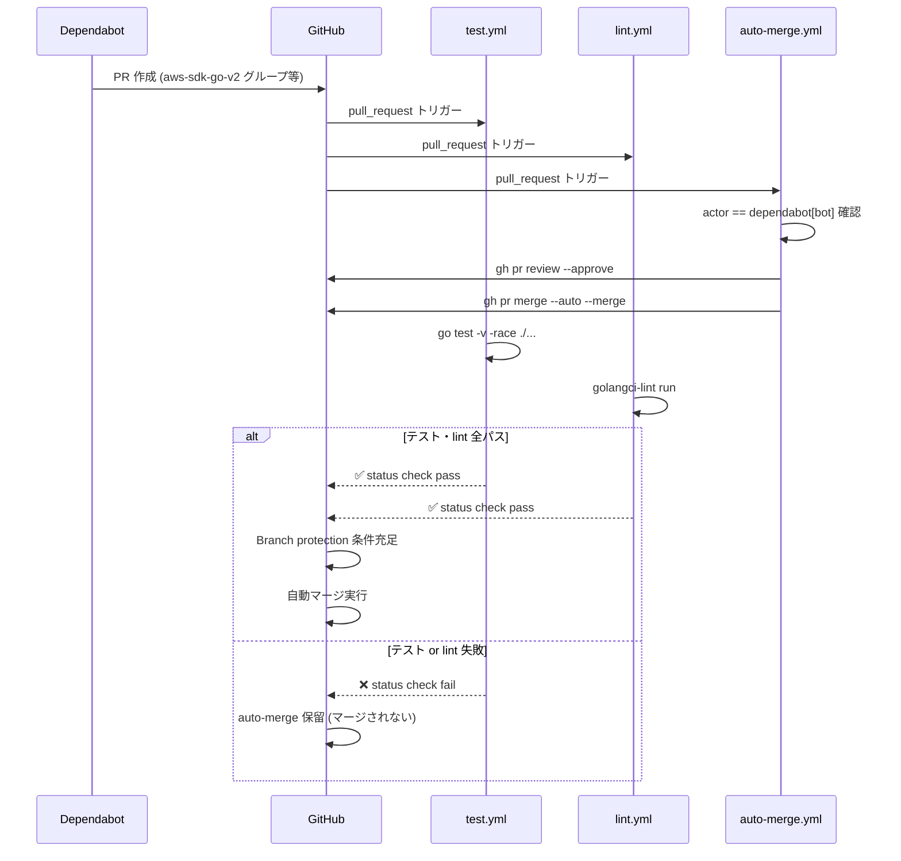
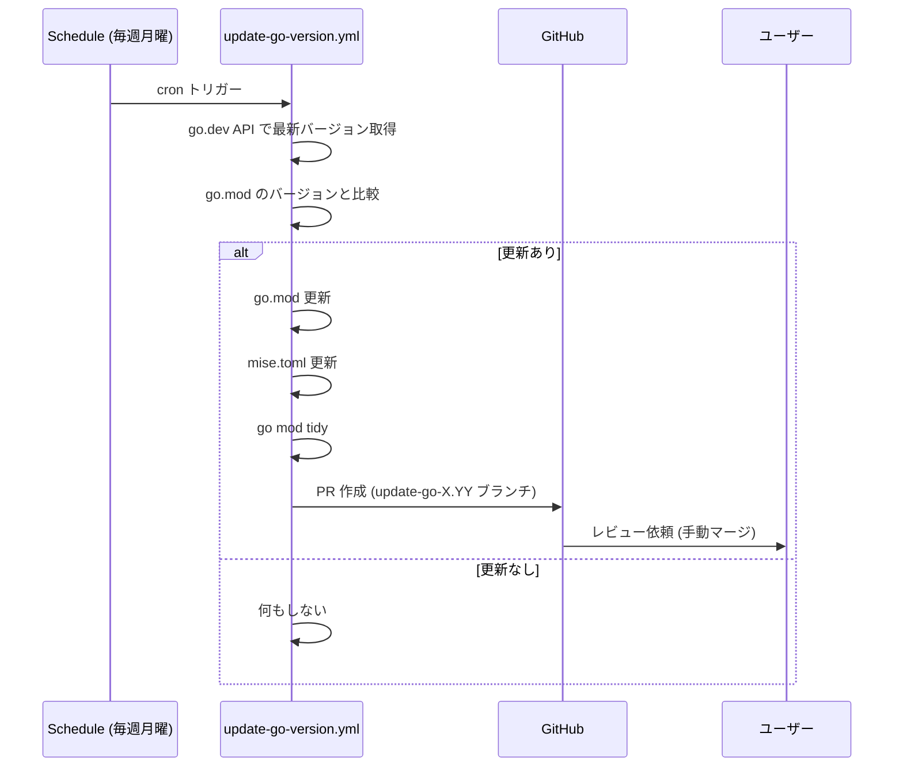

# 依存関係自動更新 + 自動マージの導入

## Context

awslogin には依存関係の自動更新が未設定。AWS SDK Go v2 や GitHub Actions のバージョン更新は全て手動。
ecspresso (kayac/ecspresso) は Dependabot で週次の gomod 更新 PR を自動作成しており、同様の仕組みを導入する。
加えて、テスト・lint 全パス時の自動マージ、Go バージョンの自動更新も実現する。

## スコープ

### 実装範囲
- Dependabot 設定 (gomod 週次 + github-actions 月次)
- AWS SDK Go v2 パッケージのグループ化 (1 PR にまとめる)
- ~~Dependabot PR の自動マージワークフロー~~ → 削除（手動マージに変更）
- Go バージョン自動更新ワークフロー (go.mod + mise.toml 同期)
- lint.yml の golangci-lint バージョンを mise.toml から動的取得に変更

### スコープ外
- golangci-lint の自動バージョン更新 (mise.toml + lint.yml の2箇所同期が必要で複雑。将来対応)
- goreleaser の `version: latest` 固定化 (別タスク)
- Renovate への移行

## ファイル変更一覧

| ファイル | 操作 | 概要 |
|---------|------|------|
| `.github/dependabot.yml` | 新規 | Dependabot 設定 |
| `.github/workflows/dependabot-auto-merge.yml` | 新規 | 自動マージワークフロー |
| `.github/workflows/update-go-version.yml` | 新規 | Go バージョン自動更新 |
| `.github/workflows/lint.yml` | 変更 | golangci-lint バージョン動的取得 |

## 実装手順

### Step 1: `.github/dependabot.yml` 作成

ecspresso の設定を参考に、awslogin 向けに調整。

```yaml
version: 2
updates:
  - package-ecosystem: gomod
    directory: "/"
    schedule:
      interval: weekly
      day: monday
      timezone: Asia/Tokyo
    groups:
      aws-sdk-go-v2:
        patterns:
          - "github.com/aws/aws-sdk-go-v2*"
          - "github.com/aws/smithy-go*"
    labels:
      - "dependencies"
      - "go"

  - package-ecosystem: github-actions
    directory: "/"
    schedule:
      interval: monthly
      timezone: Asia/Tokyo
    labels:
      - "dependencies"
      - "github-actions"
```

**設計判断:**
- `smithy-go` を AWS SDK グループに含める (aws-sdk-go-v2 の基盤ライブラリで同時更新されることが多い)
- `target-branch` は省略 (デフォルト=main)。ecspresso は v2 ブランチ指定だが awslogin は main が対象

### Step 2: `.github/workflows/dependabot-auto-merge.yml` 作成

Dependabot PR を自動 approve → auto-merge 有効化。

```yaml
name: Dependabot Auto-merge

on: pull_request

permissions:
  contents: write
  pull-requests: write
  workflows: write

jobs:
  auto-merge:
    if: github.actor == 'dependabot[bot]'
    runs-on: ubuntu-latest
    steps:
      - name: Fetch Dependabot metadata
        id: metadata
        uses: dependabot/fetch-metadata@v2
        with:
          github-token: "${{ secrets.GITHUB_TOKEN }}"

      - name: Approve PR
        run: gh pr review --approve "$PR_URL"
        env:
          PR_URL: ${{ github.event.pull_request.html_url }}
          GH_TOKEN: ${{ secrets.GITHUB_TOKEN }}

      - name: Enable auto-merge
        run: gh pr merge --auto --merge "$PR_URL"
        env:
          PR_URL: ${{ github.event.pull_request.html_url }}
          GH_TOKEN: ${{ secrets.GITHUB_TOKEN }}
```

**設計判断:**
- `dependabot/fetch-metadata@v2` でメタデータ取得。将来「メジャー更新は手動」等の条件分岐を追加しやすい
- `--auto --merge` は即マージではなく、ブランチ保護の全ステータスチェック (test, lint) 通過後にマージされる
- メジャー更新も自動マージ対象。Go では import path が変わるためビルドが通らなければマージされない

**`--auto` の動作:**
`gh pr merge --auto` は GitHub の auto-merge 機能を有効化するだけ。
ブランチ保護ルールで必須にした status check (test, lint) が全て通過するまでマージは保留される。

**GITHUB_TOKEN の権限について:**
- GitHub 公式ドキュメントでは `permissions: pull-requests: write` を明示すれば GITHUB_TOKEN で Dependabot PR の approve が可能としている
- まず GITHUB_TOKEN で試し、権限エラーが発生した場合は既存の GitHub App Token (APP_ID/APP_PRIVATE_KEY) に切り替える
- フォールバック時の変更: `secrets.GITHUB_TOKEN` → `steps.app-token.outputs.token` に差し替え + `actions/create-github-app-token@v1` ステップ追加

### Step 3: `.github/workflows/lint.yml` 変更

golangci-lint バージョンを mise.toml から動的に読み取り、single source of truth にする。

**変更前:**
```yaml
      - name: golangci-lint
        uses: golangci/golangci-lint-action@v7
        with:
          version: v2.11.3
          args: --timeout=120s
```

**変更後:**
```yaml
      - name: Get golangci-lint version from mise.toml
        id: lint-version
        run: |
          VER=$(grep 'golangci-lint' mise.toml | sed 's/.*"\(.*\)"/\1/')
          echo "version=v$VER" >> "$GITHUB_OUTPUT"
      - name: golangci-lint
        uses: golangci/golangci-lint-action@v7
        with:
          version: ${{ steps.lint-version.outputs.version }}
          args: --timeout=120s
```

**利点:** golangci-lint 更新時に lint.yml のハードコード値を変更し忘れるリスクを排除。

### Step 4: `.github/workflows/update-go-version.yml` 作成

Go の新バージョンリリースを定期チェックし、go.mod + mise.toml を同時更新する PR を作成。

```yaml
name: Update Go Version

on:
  schedule:
    - cron: "0 0 * * 1"  # 毎週月曜 00:00 UTC
  workflow_dispatch:

permissions:
  contents: write
  pull-requests: write

jobs:
  update-go:
    runs-on: ubuntu-latest
    steps:
      - uses: actions/checkout@v4

      - name: Get current Go version from go.mod
        id: current
        run: |
          VER=$(grep '^go ' go.mod | awk '{print $2}')
          echo "version=$VER" >> "$GITHUB_OUTPUT"

      - name: Get latest stable Go version
        id: latest
        run: |
          VER=$(curl -s 'https://go.dev/dl/?mode=json' | jq -r '.[0].version' | sed 's/^go//')
          # マイナーバージョンのみ取得 (1.26, 1.27 等)
          MINOR=$(echo "$VER" | grep -oE '^[0-9]+\.[0-9]+')
          echo "version=$MINOR" >> "$GITHUB_OUTPUT"
          echo "full_version=$VER" >> "$GITHUB_OUTPUT"

      - name: Check if update is needed
        id: check
        run: |
          if [ "${{ steps.current.outputs.version }}" != "${{ steps.latest.outputs.version }}" ]; then
            echo "needed=true" >> "$GITHUB_OUTPUT"
          else
            echo "needed=false" >> "$GITHUB_OUTPUT"
          fi

      - name: Update go.mod
        if: steps.check.outputs.needed == 'true'
        run: |
          sed -i "s/^go .*/go ${{ steps.latest.outputs.version }}/" go.mod

      - name: Update mise.toml
        if: steps.check.outputs.needed == 'true'
        run: |
          sed -i "s/^go = \".*\"/go = \"${{ steps.latest.outputs.version }}\"/" mise.toml

      - name: Run go mod tidy
        if: steps.check.outputs.needed == 'true'
        uses: actions/setup-go@v5
        with:
          go-version: "${{ steps.latest.outputs.version }}"
      - if: steps.check.outputs.needed == 'true'
        run: go mod tidy

      - name: Create Pull Request
        if: steps.check.outputs.needed == 'true'
        uses: peter-evans/create-pull-request@v7
        with:
          token: ${{ secrets.GITHUB_TOKEN }}
          commit-message: "chore: Go ${{ steps.latest.outputs.version }} にアップデート"
          title: "chore: Go ${{ steps.current.outputs.version }} → ${{ steps.latest.outputs.version }}"
          body: |
            Go ${{ steps.latest.outputs.full_version }} がリリースされました。

            ## 変更内容
            - `go.mod`: go ディレクティブを ${{ steps.latest.outputs.version }} に更新
            - `mise.toml`: Go バージョンを ${{ steps.latest.outputs.version }} に更新
            - `go mod tidy` 実行済み
          branch: update-go-${{ steps.latest.outputs.version }}
          labels: dependencies,go
```

**設計判断:**
- Dependabot ではなく独立ワークフロー。理由: Dependabot の gomod は Go モジュール依存を更新するが、go ディレクティブ自体の更新は限定的。mise.toml との同期も必要
- `peter-evans/create-pull-request` で PR 作成。go.mod + mise.toml + go.sum を1つの PR にまとめる
- マイナーバージョン単位 (1.26 → 1.27) で比較。パッチリリース (1.26.1 → 1.26.2) は go.mod の go ディレクティブに影響しない
- この PR は自動マージ対象外 (Dependabot ではないため)。Go メジャーバージョン更新は手動レビュー推奨

### Step 5: GitHub リポジトリ設定 (手動)

**auto-merge が動作するために必須の設定。コード変更のマージ前に実施すること。**

#### 5-1: Allow auto-merge 有効化
1. GitHub > Settings > General > Pull Requests
2. "Allow auto-merge" にチェック

#### 5-2: Branch protection rule (または Ruleset) 設定
1. GitHub > Settings > Rules > Rulesets > New ruleset (推奨) または Branches > Add rule
2. Target: `main` ブランチ
3. 必須設定:
   - **Require status checks to pass**: `test`, `lint` を追加
4. 推奨設定:
   - **Require branches to be up to date before merging**: 有効
5. **注意事項**:
   - "Require approvals" を設定する場合、GITHUB_TOKEN による approve が機能しない可能性あり。その場合は GitHub App Token に切り替えるか、approval 要件を外す
   - **"Dismiss stale pull request approvals when new commits are pushed" は OFF にする** (Dependabot の rebase 動作で approve が取り消されるのを防ぐ)

## シーケンス図

### Dependabot PR → 自動マージフロー



### Go バージョン更新フロー



## テスト設計書

### 正常系ケース

| ID | テスト内容 | 検証方法 | 備考 |
|----|-----------|---------|------|
| T1 | Dependabot が gomod PR を作成する | `.github/dependabot.yml` マージ後、Settings > Dependabot で確認 | 数日以内に初回 PR |
| T2 | AWS SDK パッケージが1 PR にグループ化される | PR タイトルに "aws-sdk-go-v2" グループ名が含まれる | 複数 SDK パッケージ同時更新時 |
| T3 | auto-merge ワークフローが Dependabot PR で起動する | Actions タブで dependabot-auto-merge ジョブ確認 | |
| T4 | test + lint 通過後に自動マージされる | PR に "Auto-merge enabled" バッジ → マージ完了 | |
| T5 | Go バージョン更新 PR が正しく作成される | workflow_dispatch で手動実行して PR 確認 | |
| T6 | lint.yml が mise.toml からバージョンを読み取る | PR で lint ジョブが正常実行されることを確認 | |

### 異常系ケース

| ID | テスト内容 | 期待動作 | 備考 |
|----|-----------|---------|------|
| E1 | テスト失敗時にマージされない | auto-merge 保留、PR はオープンのまま | ブランチ保護が安全装置 |
| E2 | 非 Dependabot PR では auto-merge が起動しない | `if: github.actor == 'dependabot[bot]'` でスキップ | |
| E3 | Go バージョンが同じ場合 PR は作成されない | `steps.check.outputs.needed == 'false'` でスキップ | |
| E4 | go.dev API がダウンしている場合 | ワークフロー失敗、次回スケジュールでリトライ | |

## リスク評価

| リスク | 重大度 | 対策 |
|--------|--------|------|
| 破壊的な依存更新がテストをすり抜ける | 高 | テスト・lint が安全装置。テストカバレッジ向上が根本対策 |
| GITHUB_TOKEN で approve/auto-merge が権限不足 | 中 | まず GITHUB_TOKEN で試す。失敗時は既存 GitHub App Token (APP_ID/APP_PRIVATE_KEY) にフォールバック |
| 自動マージで意図しないリリースが発生 | 低 | release.yml は tag push のみ。main マージではリリースされない (snapshot のみ) |
| `peter-evans/create-pull-request` の breaking change | 低 | Dependabot github-actions で更新を追跡 |
| Go バージョン更新で既存コードがビルド不能 | 低 | PR 経由で test/lint が走る。手動マージなので安全 |
| Go バージョン更新 PR と Dependabot PR の merge conflict | 低 | Go 更新は年2回程度。競合発生時は手動解消 |

## チェックリスト

### 観点1: 実装実現可能性
- [x] 手順の抜け漏れなし (4ファイル + リポジトリ設定)
- [x] 各ステップが十分に具体的 (YAML 全文記載)
- [x] 依存関係明示 (Step 5 はコードマージ前に実施)
- [x] 変更対象ファイル網羅
- [x] 影響範囲: 既存ワークフローへの影響は lint.yml のバージョン読み取り変更のみ

### 観点2: TDDテスト設計
- [x] N/A (インフラ設定のためユニットテスト不要。CI ワークフローの E2E 検証で代替)

### 観点3: アーキテクチャ整合性
- [x] 既存の GitHub Actions パターンに準拠 (checkout@v4, setup-go@v5)
- [x] go-version-file: go.mod パターンを踏襲
- [x] ワークフロー分離 (test/lint/release と同じく単責任)
- [x] 循環依存なし
- [x] ecspresso の設定パターンと統一

### 観点4: リスク評価
- [x] リスク5件を特定・対策記載済み
- [x] フェイルセーフ: ブランチ保護がマージの最終ゲート
- [x] ロールバック: ファイル削除で即座に無効化可能

### 観点5: シーケンス図
- [x] 正常フロー記述済み
- [x] エラーフロー (テスト失敗時) 記述済み
- [x] Dependabot / GitHub / Workflow 間の相互作用が明確
- [x] タイミング制御 (auto-merge は status check 完了を待つ) 記述済み
- [x] リトライ: Go バージョン更新は週次スケジュールで自動リトライ

## ドキュメント更新

- `README.md`: 「依存関係の自動更新」セクション追加 (Dependabot + 自動マージの説明)
- CHANGELOG: v3.2.0 として記録
